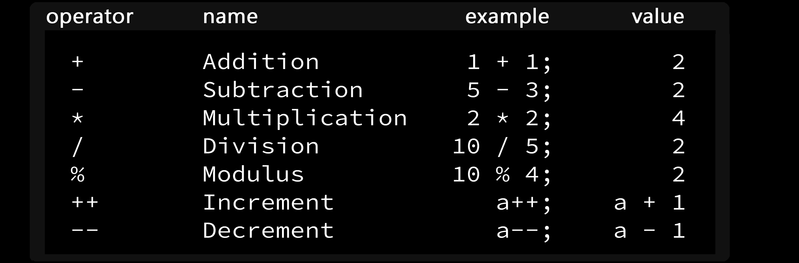
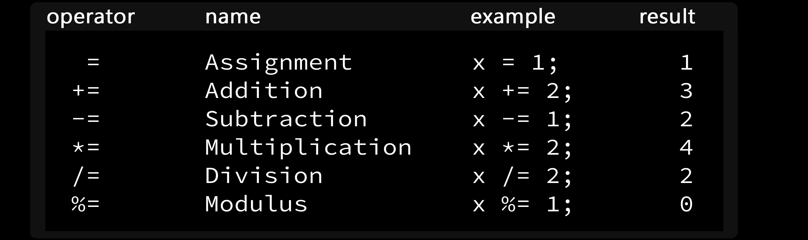
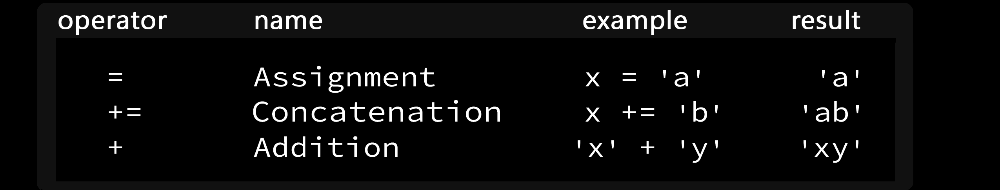
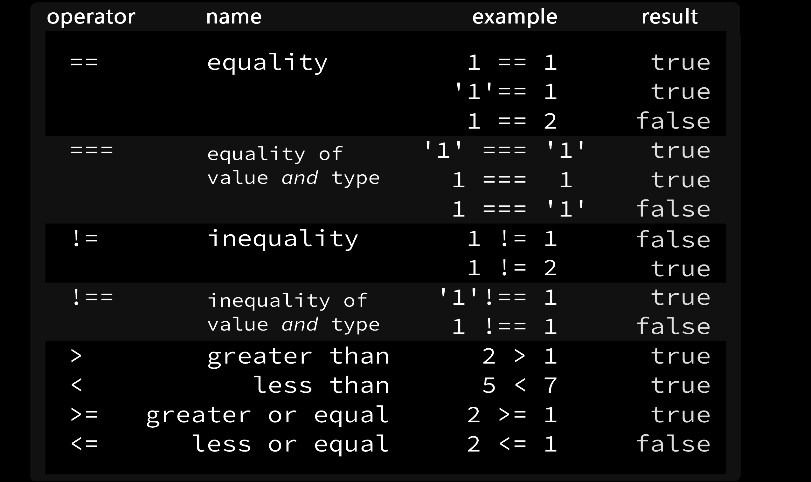
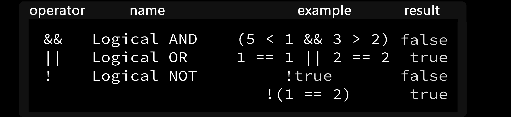

# Javascript documentation with respect to video reference #

<a href="https://www.youtube.com/watch?v=PkZNo7MFNFg"> Click me to vist the reference video </a>

# commenting in Js files # 

* The lines will not be executed by the compiler.

* Use // => for inline commenting.

* Use /* ... */ => For multiline commenting.

* EX:

```javascript
console.log("hi");

// console.log("hello");  inline comment not executed.


//multiline comment (Not executed)
/*
bhcbcdbjc
 bhcbbc historychbhbhj
 cbhsdcbbdsc
 */
```
* Output:

```javascript
hi
```
# Variables # 

* Variables are used to store data in memory.We can store any kind of data using variables.

* In javascript,We use three kind of variables for assigining data.

  * var
  * let
  * cost

 ## Ex:1 var ## 

 ```javascript
//var  
// 1) We can declare variables globally.
// 2) we can reassign values with var keyword.
var a = "vijay";
console.log(a);
a=10;
console.log(a);

 ```
* Output:

```javascript
vijay
10
```
 ## Ex:2 let ## 

 ```javascript
//let
// 1) We can use it for specific scope not for global usage
// 2) We can reassign the value using let
let b=20;
console.log(b)

b="hi";
console.log(b);
 ```
* Output:

```javascript
20
hi
```
 ## Ex:3 const ## 

 * This must be used with initialisation and  should not used for reassignning.

 ```javascript

//const

//  1) We must use declare a variable with it's value in same line in const keyword

const c = 10;
console.log(c);

// 2) We cannot reassign the const value (It will throe declartion error)
 ```
* Output:

```javascript
10
```
# Storing values with assignment operator (=) #

* =  --> This opeartor assigns the right side value to left side variable.

* EX: var a="Vijay";  --> Here, "vijay" stirng value is assigned to the  a variable.

# Operators #

## Basic operators ##

```javascript
//addition 

let a=10+20; 
console.log(a);

//subtraction

let b=10+20; 
console.log(b);

//mutiplication  * astreit symbol

let c=10*20; 
console.log(c);

//division

let d=10/20; 
console.log(d);

//modulas or remainder

let e=10%20; 
console.log(e);


//Increament

let f=10;
f++;
console.log(f);

//Decreament

let g=10;
g--;
console.log(g);

```
* Output:

```javascript
30
30
200
0.5
10
11
9
```
## Compound assignments ##

```javascript
//addition 

let a =10;
a += 20;
console.log(a);

//subtraction

let b =10;
b -= 20;
console.log(b);

//Multiplication

let c=10;
c *= 20;
console.log(c);

//Division

let d=10;
d /= 20;
console.log(d);

//modulas

let e=10;
e %= 20;
console.log(e);
```
* Output:

```javascript
30
-10
200
0.5
10
```
# String #

## String declaration ##

* We should declare inside "" or ''.

## Escape sequence in string ##

* There are some escapse sequences that  is not considered within string. They are:
  * \n --> new line
  * \b -->backspace
  * \f --> form control 

* Ex:

```javascript
//Using \n
let string ="I am vijay \nI am arun";
console.log(string);

//Using \b

let a = "Hii\b hello";
console.log(a);

//Using \f

let b="Welcome \fgood morning";
console.log(b);
```

* Output:

```javascript
I am vijay 
I am arun
Hi hello
Welcome 
        good morning
```
## string Immutability ##

* They cannot be altered once created.

### Example ###

```javascript
//correct method to alter string
// Use to change the whole string
let a ="Bi";
a = "Hi";
console.log(a);

//Wrong method to alter string

let b="bi";
b[0]='h';
console.log(b);   //Not change
```
* Output:

```javascript
Hi
bi
```
## string length ##

* To find string length , Use stringnmae.length method.

* We can also find letters in string using length method

### Example ###

```javascript
// length

let a = "Hi i am vijay";
console.log(a.length);


//find first letter

let b = "vijay";
console.log(b[0]);

//find Nth letter

let c = "Good morinig";
console.log(c[8]);

//find last letter in large string
let d="ajnsdhvdchjdcbndcdcbz";
console.log(d[d.length-1]);

//find N'th last letter in string
let e="bcsdbcjdbbcnjkbjDFGbsh8";
console.log(e[e.length-2]);
```
* Output:

```javascript
13
v
i
z
h
```
## string concatination ##
 * We can merge two strings using + operator and += operator.

 ### Example ###

```javascript
//Using +
let a = "I am";
let b = "vijay";
console.log(a  + " " +  b );

//Using +=
let c="He is";
c += " Vikram";
console.log(c);
```
* Output:

```javascript
I am vijay
He is Vikram
```
## String constructing with varibles ##

* we can assign strings to variables and use the variables in another string.

### Example: Word blank program ###

```javascript
function wordBlank(noun,adjective,verb,adverb){
    let a ="The" + " " + adjective + " " + noun + " " + verb + " " + adverb + "." ;
    return a;

}
console.log(wordBlank("dog","dirty","ran","fast"));
console.log(wordBlank("cat","beautiful","eat","well"));
```
* Output:

```javascript
The dirty dog ran fast.
The beautiful cat eat well.
```

# Array #

* Array allows us to storevmultiple values using [].
* Elementsv inside array will be seperated by ,
* Elements can be any data type.

```javascript
let a = [1,2,3,"HI",'a',true];
console.log(a);
```
* Output:

```javascript
[ 1, 2, 3, 'HI', 'a', true ]
```

#  Nested Array #

* Arrays inside array also known as multi diamensional array.

```javascript
let nest = [[1,2,3],[4,5,6],[7,8,9,10]];
console.log(nest);
```
* Output:

```javascript
[ [ 1, 2, 3 ], [ 4, 5, 6 ], [ 7, 8, 9, 10 ] ]
```
## Array access elements using [index] ##

* [index] We can access array elements using this bracket notation.

* Array index starts from 0.

* We can access nested array elements using [][] where fisrt []  represents the main array index and next[] represennts the subarray index.

```javascript
let a = [1,2,3,"HI",'a',true];

let nest = [[1,2,3],[4,5,6],[7,8,9,10]];

console.log(a[0]);

console.log(nest[2]);

console.log(nest[0][1]);   // 2      
```
* Output:

```javascript
1
[ 7, 8, 9, 10 ]
2
```
## Array modify elements using [index] ##

* WE can modify or change the elements in the array using [] as below.

### Ex : noramal array ###
```javascript
let normal = [10,20,30,40];
console.log("Before modification:",normal);
normal[3]=80;
console.log("After modification:",normal);
```
* Output:

```javascript
Before modification: [ 10, 20, 30, 40 ]
After modification: [ 10, 20, 30, 80 ]
```

### Ex : Nested array ###

```javascript
//Nested array

let nest = [[1,2,3],["hi","Hello"],[4,5]];
console.log("Before modification:",nest);
nest[2]=['a','b','c'];
console.log("After modification:",nest);
```
* Output:

```javascript
Before modification: [ [ 1, 2, 3 ], [ 'hi', 'Hello' ], [ 4, 5 ] ]
After modification: [ [ 1, 2, 3 ], [ 'hi', 'Hello' ], [ 'a', 'b', 'c' ] ]
```
## Array Manipulation using builtin functions ##

##  1) Adding elements in front using unshift() ##

* It adds elements to the beginning of array using <b>Arrayname.unshift([new element/new array]);  </b>

### Example ###

```javascript
// Normal array
let a = [1,5,78];
console.log("Before unshift:",a);
a.unshift(0);
console.log("After unshift:",a);

//Nested array

let b = [["rice",10],["wheat",5],["mango",10]];
console.log("Before unshift:",b);
b.unshift(["orangr",5]);
console.log("After unshift:",b);
```
* Output:

```javascript
Before unshift: [ 1, 5, 78 ]
After unshift: [ 0, 1, 5, 78 ]
Before unshift: [ [ 'rice', 10 ], [ 'wheat', 5 ], [ 'mango', 10 ] ]
After unshift: [ [ 'orangr', 5 ], [ 'rice', 10 ], [ 'wheat', 5 ], [ 'mango', 10 ] ]
```


## 2) Adding elements in last using push() ##

* It adds elements to the last of array using <b>Arrayname.push([new element/new array]);  </b>

### Example ###

```javascript
// Normal array
let a = [1,5,78];
console.log("Before push:",a);
a.push(100);
console.log("After unshift:",a);

//Nested array

let b = [["rice",10],["wheat",5],["mango",10]];
console.log("Before push:",b);
b.push(["orange",5]);
console.log("After push:",b);
```
* Output:

```javascript
Before push: [ 1, 5, 78 ]
After unshift: [ 1, 5, 78, 100 ]
Before push: [ [ 'rice', 10 ], [ 'wheat', 5 ], [ 'mango', 10 ] ]
After push: [ [ 'rice', 10 ], [ 'wheat', 5 ], [ 'mango', 10 ], [ 'orange', 5 ] ]
```

## 3)  Removing elements in first using shift() ##

* It removes elements from the last of array using <b>Arrayname.shift();  </b>

### Example ###

```javascript
// Normal array
let a = [1,5,78];
console.log("Before shift:",a);
a.shift();
console.log("After shift:",a);

//Nested array

let b = [["rice",10],["wheat",5],["mango",10]];
console.log("Before shift:",b);
b.shift();
console.log("After shift:",b);

```
* Output:

```javascript
Before shift: [ 1, 5, 78 ]
After shift: [ 5, 78 ]
Before shift: [ [ 'rice', 10 ], [ 'wheat', 5 ], [ 'mango', 10 ] ]
After shift: [ [ 'wheat', 5 ], [ 'mango', 10 ] ]
```
## 4)  Removing elements in last using pop() ##

* It removes element in the last of array using <b>Arrayname.pop();  </b>

### Example ###

```javascript
// Normal array
let a = [1,5,78];
console.log("Before pop:",a);
a.pop();
console.log("After pop:",a);

//Nested array

let b = [["rice",10],["wheat",5],["mango",10]];
console.log("Before pop:",b);
b.pop();
console.log("After pop:",b);

```
* Output:

```javascript
Before pop: [ [ 'rice', 10 ], [ 'wheat', 5 ], [ 'mango', 10 ] ]
After pop: [ [ 'rice', 10 ], [ 'wheat', 5 ] ]
```
# Functions # 

* Functions are called mini programs.
* It allows us to create reusabe code.

## Simple function syntax ##

```javascript

function functionName() {

     --- set of statements.--

}

functionNmae();

```
## EX: Simple function to display text ##

```javascript

function show()
{

    console.log("I am simple function example");

}

show();                                      //This is function call  (We can reuse the same function using this call)
```
* Output:

```javascript
I am simple function example
```


## passing values to functions with arguments ##

### Parameters ###

  * parameters are variables that aare placeholders for the values that are to be input to afunction when it is called.

 ### Arguments ### 
  
  * Argumrnts are values that are considered as inputs which is pased during function call.

 ## Syntax for functions with parametrs and arguments ## 

 ```javascript

 function functionName(variable1,variable2)     //This variables are parameters.
 {
      ---Set of staements---
 }

 functionName(value for variable1,value for variable 2);   //This values are arguents.

 ```
 ## EX: functions with arguments and parametrs ## 

 ```javascript
 function add(a,b){
    console.log(a+b);
}
add(10,45);
add(-56,-300);
 ```

 * Output:

 ```javascript
55
-356
 ```

## Global Scope and functions ##

  * Scopr refers to the visiblity of variables.

  * Global scope --> We can use anywhere in the program even in function.

* NOTE: I consoles , the variables declared without any keyword will automatically consider as var keyword.But ,text editrs must require any keyword to      assign variables.

## EX : ##

```javascript
var global = 10;    //Declaring global

function fun1(){

    local=50;           //Declare variable without keyword (Considered as global)

}

function fun2(){

    var output;

    if(typeof global != 'undefined'){
        output="Global:"+global;
    }

    console.log(output);

    if(typeof local != 'undefined'){
        output = "Local:"+ local;
    }

    console.log(output);
    
}

fun1();
fun2();
```
* Output:

```javascript
Global:10
Local:50
```

## Local Scope and functions ##

  * variables declared within the functions will not visible outside of the function.
  * We cannot use thode variables out of the functions .If we try to do it , the reference error will be return.

  ## Example:1 correct method ##

```javascript
function local(){
    var a=67;       //Declaring within function
   
    console.log(a);    //Using within function
}
local();
  ```

* Output:

```javascript
67
```

  ## Example:2 Wrong method ##

```javascript
function local(){
    var a=67;       //Declaring within function
   
    console.log(a);    //Using within function
}
local();

console.log(a);         //Using in global produce error
  ```

* Output:

```javascript
/home/guest/Documents/video/jsvideo/functions/referror.js:8
console.log(a);
            ^

ReferenceError: a is not defined
```

## Global vs Local scope in Functions ##

 * Declaring different variables with same variable names , one as gloal and another one as function local.
 * Then the functional local variable will override the glbal variable. it will be used while calling the function.

 ## Ex: ##

 ```javascript
var same="hi";         // Declaring global

function demo(){

    var same = "Hello";          //Declaring same variable inside function
    return same;
}
console.log(demo());           //Function call return the inside function value
console.log(same);             //global usage will not affect the inside function variable.
 ```
* Output:

```javascript
Hello
hi
```
# Functions with return # 
 * return statement in function returns the some statement to the function call.
## EX : Simple function with return statement ##

```javascript
function fun(num){
    return num*25;
}
console.log(fun(20));
```
* Output:

```javascript
500
```

# Undefined value in return fuctions #
  * There is no compeltion to contain return statement in the functions.
  * Without return in functions will produce undefined while calling the function.
## EX : ##

```javascript
function fun(){
    var sum =0;
    sum += 28;
}
console.log(fun());
```
* Output:

```javascript
undefined
```
## Overcome method : 1 ##
  * To overcome this problem we should use return staement inside the function.

```javascript
function fun(){
    var sum=0;
    sum +=89;
    return sum;
}
console.log(fun());
  ```
* Output:
```javascript
89
```
## Overcome method : 2 ##
  * To overcome this problem we should use return or consle.log for the variable sum inside the function.

```javascript
function fun(){
    var sum =0;
    sum +=28;
    console.log(sum);
}
fun();
  ```
* Output:
```javascript
28
```

# Assignment variables for returned value #
 * We can assign the return statement vaues to avariable by assigning a variable to the function call.

```javascript
function math(a,b){
    var value=1;
    return (value*10)+a+b ;
}
 let res=math(2,5);
 console.log(res);
```

* Output:

```javascript
17
```

# JSON>stringify() #
 * JSON>stringify converts mostly objects and arrays to string.

 ## EX: ##

 ```javascript
 let a = [10,46];
console.log(a);                      //Print as array
console.log(JSON.stringify(a));      //prints as string

let obj = {
    name: "vijay",
    age : 10
}
console.log(obj);                       //prints as object
console.log(JSON.stringify(obj));        //prints as string
 ``` 
* Output:

```javascript
[ 10, 46 ]
[10,46]
{ name: 'vijay', age: 10 }
{"name":"vijay","age":10}
```
# Stand inline #

* It is functionality of queue datastructure.
* Queue datastructure follows first in first out rule.
* This uses nextLine function logic in it.

## EX : inLine function ##
```javascript
var testarr=[1,2,3,4,5];

function nextInline(arr,item){

     arr.push(item);
   return arr.shift();
}
console.log("Before:" + JSON.stringify(testarr));
console.log(nextInline(testarr,6));
console.log("After:"+JSON.stringify(testarr));
```
* Output:

```javascript
guest@stalin:~/Documents/video/jsvideo/standInline$ node inline.js
Before:[1,2,3,4,5]
1
After:[2,3,4,5,6]
```
# Operators # 

## Arithmetic Operators ##
<br>



## Assignment Operators ##
<br>




## String ##
<br>



## Comparison Opearors ##
<br>



<br>

## Logical Operator  ##
<br>



* Logical AND (&&)

* it performs * operation that means,

   
   * 0 0 --> 0
   * 0 1 --> 0
   * 1 0 --> 0
   * 1 1 --> 1

* In other words, If both conditiona are true, only Result is true.

* Logical OR (||)

* it performs + operation that means,

         
   * 0 0 --> 0
   * 0 1 --> 1
   * 1 0 --> 1
   * 1 1 --> 1

* In other words if any one of the condition is true the result is true.

* Logical NOT (!)

     * 0 --> 1
     * 1 --> 0

 * In other words Just opposite.

<br> 

# conditional statements #

# if #

 * Check for the condition inside the brackets , if it is true execute if part otherwise none.

 ## EX: ##

```javascript
function check(a)
{
if(a==100){
    return "IF part executed";
}

}
console.log(check(100));       //condition true means execute if block

console.log(check(25));          //false means print undefined because nothing is defined.
```
* Output:

```javascript
IF part executed
undefined
```


# if-else  #

 * Check for the condition inside the brackets , if it is true execute if part otherwise executes else part.

 ## EX: ##

```javascript
function check(a){
    
    if(a%2==0){
        return "number is even (IF part)"
    }
    else{
        return "Number id odd (ELSE part)"
    }
}
console.log(check(18));              
console.log(check(105));

```
* Output:

```javascript
number is even (IF part)
Number id odd (ELSE part)
```
# if - else if - else   #

 * Check for the condition inside the brackets , if it is true execute if part otherwise check next condition in elseif if that is true executes elseif part
 otherwise executs else part.

 ## EX: ##

```javascript
function check(a){
    if(a==0){
        return "Number is 0 {IF PART executed}";
    }
    else if(a%2==0){
        return "Number is even {ELSEIF part executed}";
    }
    else{
        return "Number is odd{ELSE part executed}";
    }
}
console.log(check(0));
console.log(check(1));
console.log(check(4886));

```
* Output:

```javascript
Number is 0 {IF PART executed}
Number is odd{ELSE part executed}
Number is even {ELSEIF part executed}
```

# chaining eles if statements   #

 * We can use more than one else if statements acoording to the conditions required.
 * But we should focus on the procedence of conditions that we use.

 ## EX: ##

```javascript
function check(marks){
    if(marks>=90){
        return "O grade \n Outstanding{ IF }"
    }
    else if( marks>=80 && marks<90 ){
        return "A+ grade \n excellent { 1 st ELSEIF}";
    }
    else if(marks>=70 && marks<80 ){
        return "A grade \n very good{ 2 nd ELSEIF }";
    }
    else if(marks>=60 && marks<70 ){
        return "B+ grade \n Good{ 3 rd ELSEIF }";
    }
    else if(marks>=50 && marks<60 ){
        return "B grade \n Need to improve more { 4 th ELSEIF }";
    }
    else{
        return "FAIL \n GOOD LUCK NEXTTIME{ ELSE }";
   
    }

}

console.log(check(0));
console.log(check(50));
console.log(check(65));
console.log(check(70));
console.log(check(81));
console.log(check(100));

```
* Output:

```javascript
FAIL 
 GOOD LUCK NEXTTIME{ ELSE }
B grade 
 Need to improve more { 4 th ELSEIF }
B+ grade 
 Good{ 3 rd ELSEIF }
A grade 
 very good{ 2 nd ELSEIF }
A+ grade 
 excellent { 1 st ELSEIF}
O grade 
 Outstanding{ IF }
```

# Golf code programe #

```javascript
var Nickname=["Hole-in-one","eagle","Birdie","Par","Bogey","Double bogey","Go home"];
function golf(par,stroke){
    if(stroke==1){
        return Nickname[0];
    }
    else if( stroke <= par-2 ){
        return Nickname[1];
    }
    else if( stroke == par-1 ){
        return Nickname[2];
    }
    else if( stroke == par ){
        return Nickname[3];
    }
    else if( stroke == par+1 ){
            return Nickname[3];
    }
    else if( stroke == par+2 ){
        return Nickname[4];
     }
     else if( stroke >= par+3 ){
        return Nickname[5];
     }

}
console.log(golf(1,1));
console.log(golf(5,8));
console.log(golf(2,2));
console.log(golf(2,4));
```
* Output:

```javascript
 Hole-in-one
Double bogey
Par
Bogey
 ```
# Switch statements #

* Switch statements usually helpful for checking multiple conditions.
* It is more easy to understand and simple than nested if-else statements.
* Mainly it is used for menu and operatioj according to the selected menu.
* Always set switch ( true )  if there is more than comparison operation.
* break keyword is compulsary for every case otherwise it executes all the cases provided.
* use default keyword to display the error message usually.There is not compulsion to use default as last,we can use it anywhere. 

## Syntax for switch statements ##

 ```javascript
 switch(condition){
   case 1:
     set of statements;
     break;
   case 2:
     set of statements;
     break;  
   case 3:
     set of statements;
     break; 
     ...
   case N:
     set of statements;
     break;   
   default:
     display error message;
     break;  

 }
 ```

##  EX:1  Simple comparitive in switch ##

```javascript
function com(a){
    var display;
    switch(a){
        case 1:
            display="a is equal  to 1";
            break;
        case 2:
            display="a is equal to  2";
            break;    
        case 3:
            display="a is equal to 3";
            break;   
        default:
            display="a is not 1 , 2 ,3 ";      
    }
    return display;
    
}
console.log(com(1));
console.log(com(2));
console.log(com(3));
console.log(com(89));
```

* Output:

```javascript
a is equal  to 1
a is equal to  2
a is equal to 3
a is not 1 , 2 ,3 
```

## EX:2: Minicalci program ##

```javascript

    let choose;
    console.log(" 1.addition \n 2.subtraction \n 3.Mutiplication \n 4.division");
    function calci(choose,a,b){
    switch(choose){
        case 1:
            res=a+b;
            console.log("Addition of "+ a + " and " + b + " is : " + res);
            break;
        case 2:
              res=a-b;
              console.log("Subtraction  of "+ a + " and " + b + " is : " + res);
            break; 
        case 3:
            res=a*b;   
            console.log("Multiplication  of "+ a + " and " + b + " is : " + res);
           break;     
        case 4:
            res=a/b;
            console.log("division quatient  of "+ a + " and " + b + " is : " + res);
            break;  
        default:
            console.log( " Wrong input ");    
            break;
    }

    }
    calci(1,10,67);
    calci(2,67,879);
    calci(3,670,879);
    calci(4,60,89);

```

* Output:

```javascript
  1.addition 
 2.subtraction 
 3.Mutiplication 
 4.division
Addition of 10 and 67 is : 77
Subtraction  of 67 and 879 is : -812
Multiplication  of 670 and 879 is : 588930
division quatient  of 60 and 89 is : 0.6741573033707865
```
## Returning boolean values from function  ##

 * All conditional statemets usually return the boolean values true or false.

 ```javascript
 function boolean(a,b){
    return a==b;
}
console.log(boolean(10,56));
console.log(boolean(10,10));
 ```
* Output:

```javascript
false
true
```

## Early return in functions ##

* The function is terminated when it meets the return.

```javascript
function demo(a,b){
    
        return  a+b;    //eary return executes and produce output
        return a-b;       //this is omitted

}
console.log(demo(1,8));
```

* Output:

```javascript
9
```
## CArd count ##
```javascript
function card(value){
    var count=0;
    switch(value){
        case 2:
        case 3:
        case 4:    
        case 5:   
        case 6:   
        case 7:   
           count++;
           break; 
        case 8:
        case 9:
        case 10:
           count=count;
           break;
        case "J":   
        case "Q": 
        case "K": 
        case "A":    
             count-- ;
             break;
    }
var result;
if(count>=0){
    result="Hold";
}
else{
    result="Bet";
}
return "count is " + count + " " + " So Need to " + result;


}
console.log(card(2));
console.log(card("A"));
console.log(card(0));
console.log(card("Q"));
```
* Output:

```javascript
count is 1  So Need to Hold
count is -1  So Need to Bet
count is 0  So Need to Hold
count is -1  So Need to Bet
```

# Objects #

* Objects are similar to arrays which is alsi used to store multiple value with different datatypes.
* Objects contains properties and values within it.
* It is denoted with {}.

## Sample object ##

```javascript
let family = {
    name : "Vijay",
    Mother:"Ponni",
    Father:"Subramani",
    age:20,
    Village:"Valrasaplayam"
}
console.log(family);
```
* Output:

```javascript
{
  name: 'Vijay',
  Mother: 'Ponni',
  Father: 'Subramani',
  age: 20,
  Village: 'Valrasaplayam'
}
```
## Accessing object properties ##

* we can access the properties of objects using . and [] notations.
* ObjectName.Property ;  OR   ObjectName["property"];

```javascript
let object = {
    date : 10,
    day : "Wednesday",
    year : 2022,
    message : "stay happy"
}

console.log(object);

//Using .notation

console.log(object.day);

//Using [] notation

console.log(object["date"]);
console.log(object['message']);
```
* Output:

```javascript
{ date: 10, day: 'Wednesday', year: 2022, message: 'stay happy' }
Wednesday
10
stay happy
```
## Update Object properties ##

* We can update the properties of objects by assing new value to a current object property.

* obj.property=Newvalue;

* We can also add new object property by assinging the new property to new value.

* obj.newProperty = newValue.

```javascript
let timetable = {
    monday : "Music class",
    Tuesday : "Dance class",
    Wednesday : "Kungfu class",
    Thursday : "Violin class",
}
console.log( "Object before any updation : \n",timetable);

// Updating value of a existing property

timetable.Wednesday="Singing class";
console.log( "Object After Update new value to existing  property : \n",timetable);

//Updating a property with new value

timetable.Sunday = "Cooking class";
console.log("Object After update new property : \n", timetable);
```
* Output:

```javascript
Object before any updation : 
 {
  monday: 'Music class',
  Tuesday: 'Dance class',
  Wednesday: 'Kungfu class',
  Thursday: 'Violin class'
}
Object After Update new value to existing  property : 
 {
  monday: 'Music class',
  Tuesday: 'Dance class',
  Wednesday: 'Singing class',
  Thursday: 'Violin class'
}
Object After update new property : 
 {
  monday: 'Music class',
  Tuesday: 'Dance class',
  Wednesday: 'Singing class',
  Thursday: 'Violin class',
  Sunday: 'Cooking class'
}
```
## Delet object property ##
* We can delete any object property by using delete objectName.Property method.

```javascript
var workers = {
    w1 : "Logesh",
    w2: "Vijay",
    w3 : "Vikram"
}

console.log("Before deleting : \n", workers);

delete workers.w1;

console.log("After deleting : \n", workers);

//Delete whole object

delete workers;      //We can't delete whole object

console.log("After deleting the object using delete it still shows the object \n ",workers);     
```
* Output:

```javascript
Before deleting : 
 { w1: 'Logesh', w2: 'Vijay', w3: 'Vikram' }
After deleting : 
 { w2: 'Vijay', w3: 'Vikram' }
After deleting the object using delete it still shows the object 
  { w2: 'Vijay', w3: 'Vikram' }

```
## Lookup program ##

```javascript
function lookup(value){
    var res;
let dic = {
    "apple" : "A fruit",
    "Bring" : "fetch",
    "cat"   : "An small animal",
    "dig"   : "dig"
};
res=dic[value];
return res;

}
console.log(lookup("apple"));
console.log(lookup("cat"));
```
* Output:

```javascript
A fruit
An small animal
```
## Tesing objects for proprty ##
 * We can verify whether the particular proprty is available or not in the object using the hasOwnPrperty method.
 * Syntax : objectName.hasOwnProperty(propertyname);

```javascript
function check(value){
    var res;
    let obj = {
        1 : "v1",
        2 : "v2",
        "hi": 675,
    }
    res = obj[value];
    if(obj.hasOwnProperty(value)){
        return "Yes here it is :"+obj[value];
    }
    else{
        return "No"
    }
}
console.log(check(1));
console.log(check(5));
console.log(check("hello"));
console.log(check("hi"));
``` 
* Output:

```javascript
Yes here it is :v1
No
No
Yes here it is :675
```
## Objects inside array ##

* We can insert many objects inside the array.

### Ex ###

```javascript
let array = [
    {
        p1 : "Value",
        p2 : "value",
        p3 : [
            1,2,3
        ],
        
    },
    {
        p21 : "Value1",
        p22 : "value2",
        p23 : [
            1,2,3,'j'
        ],
        
    },
];
console.log(array);
console.log(array[0]);
console.log(array[1]);
```
* Output:

```javascript
[
  { p1: 'Value', p2: 'value', p3: [ 1, 2, 3 ] },
  { p21: 'Value1', p22: 'value2', p23: [ 1, 2, 3, 'j' ] }
]
{ p1: 'Value', p2: 'value', p3: [ 1, 2, 3 ] }
{ p21: 'Value1', p22: 'value2', p23: [ 1, 2, 3, 'j' ] }
```

## Nested object ##

* Object inside object is called nested object .

* We can access the inner object properties through the sae . or [] notations

```javascript
let obj = {
    nested : {
        n1: "Value",
        n1a : "Value",
    },
    normal1 : 2,
    normal2: 5,
}

console.log(obj.nested.n1a);
console.log(obj["nested"]["n1"]);
```

* Output:

```javascript
Value
Value
```
## Accessing object properties inside array  ##

* We can even access the object properties inside arrays using . and [] notations.

```javascript
let array = [
    {
        p1 : "Value",
        p2 : "value",
        p3 : [
            1,2,3
        ],
        
    },
    {
        p21 : "Value1",
        p22 : "value2",
        p23 : [
            1,2,3,'j'
        ],
        
    },
];
//access object proprties 

console.log(array[1].p23);
console.log(array[1].p23[3]);
console.log(array[0]["p1"]);
```
* output:

```javascript
[ 1, 2, 3, 'j' ]
j
Value
```

## Record collection program ##

```javascript
var collection = {
    "1" : {
        "Name": "vijay",
        "Things": ["bag,shirt"],
    } ,
    "2" : {
        "Name": "Surya",
        "age": 22,
        "Things": ["bag,shirt","purse"],
    } ,
    "3" : {
        "Name": "kumar",
      
    } ,
    

}

var copy = JSON.parse(JSON.stringify(collection)); 

function update(id,prop,value){
    if(value===""){
        delete collection[id][prop];
    }
    else if(prop==="Things"){
        collection [id][prop] =  collection [id][prop] || [];
        collection [id][prop].push(value);
    }
    

    else {
        if(id===collection[id]){
        collection[id][prop]= value;
        }
      

    }
      return collection;
}
update("1","Name","");
update("2","Name","Ashwin");
update("3","Name","jo");
update("3","Things","['a bag','a plate']");
console.log("Original data :\n",copy);
console.log("Updated data :\n",collection);
```

* Output:

```javascript
Original data :
 {
  '1': { Name: 'vijay', Things: [ 'bag,shirt' ] },
  '2': { Name: 'Surya', age: 22, Things: [ 'bag,shirt', 'purse' ] },
  '3': { Name: 'kumar' }
}
Updated data :
 {
  '1': { Things: [ 'bag,shirt' ] },
  '2': { Name: 'Surya', age: 22, Things: [ 'bag,shirt', 'purse' ] },
  '3': { Name: 'kumar', Things: [ "['a bag','a plate']" ] }
}
```
### NOTE : JSON.parse method  ###

* Use the JavaScript function JSON.parse() to convert text into a JavaScript object.
* Make sure the text is in JSON format, or else you will get a syntax error.

# loops #

* lopps allow us to execute same code multiple times.

## while ##

* A while loop will iterate for an indefinite number of times until the specified condition (there is only one) evaluates to false.

```javascript
let arr=[];
var i=0;

while(i<5){
    arr.push(i);
    i++;

}

console.log(arr);
```
* Output:

```javascript
[ 0, 1, 2, 3, 4 ]
```

## for ##

## Synatx ##


### EX : ###

```javascript
let arr=[];
for(let i=0;i<10;i++){
    arr.push(i);
}
console.log(arr);
```
* Output:

```javascript
[
  0, 1, 2, 3, 4,
  5, 6, 7, 8, 9
]
```
## Display odd array and even array using for loop ##

```javascript
let odd=[];
for(let i=1;i<10;i+=2){
    odd.push(i);
}
console.log("odd array : ", odd);

let even=[];
for(let i=0;i<10;i+=2){
    even.push(i);
}
console.log("Even  Array " , even);
```
* Output:

```javascript
odd array :  [ 1, 3, 5, 7, 9 ]
Even  Array  [ 0, 2, 4, 6, 8 ]
```
## count backword with for loop in array ##

```javascript
let nor=[];
for(let i=10;i>0;i--){
    nor.push(i);
}
console.log(nor);

//reverse odd
let odd=[];
for(let i=9;i>0;i-=2){
    odd.push(i);
}
console.log(odd);

//reverse even
let even = [];
for(let i=10;i>1;i-=2){
    even.push(i);
}
console.log(even);
```
* Output:

```javascript
[
  10, 9, 8, 7, 6,
   5, 4, 3, 2, 1
]
[ 9, 7, 5, 3, 1 ]
[ 10, 8, 6, 4, 2 ]
```

## Array iteration with for loop ##

```javascript
let a = [1,2,3,4,5,100,1000];
let t=0;
for(let i=0;i<a.length;i++){
    t=t+a[i];
}
console.log(t);
```
* Output:

```javascript
1115
```
## Nested array multiplication ##

```javascript

function mul(arr){
    let res=1;
    for(let i=0;i<arr.length;i++){
        for(let j=0;j<arr[i].length;j++){
        res *= arr[i][j];
        }
      }
console.log(res);
}
mul([[1,1,36],[1,7],[10,78]]);
```

* Output:

```javascript
196560
```
## do while ##

### Syntax ###

```javascript

do{
  --- set of statements ---
} while (condition);

```
* do - while atleaset executes the statements once even the condition is false.

* It is slightly different from while.

* The do-while loop is mostly used in menu-driven programs where the termination condition depends upon the end user.

### EX : ###

```javascript
//do-while 
let a = [];
var i=0;
do{
  
    a.push(i);
    i++;

}while(i>5)    // condition false but executed one time
console.log(a);


// while
let b=[];
var j=0;
while(j>5){     // condition false so not executed 
    b.push(j);
    j++;

}
console.log(b);

```
* Output:

```javascript
[ 0 ]
[]
```

## profile lookup program ##

```javascript
var contacts = [
    {
        "name" : "A",
        "Number" : "1234567890",
        "Likes" : ["book","food"]
    },
    {
        "name" : "B",
        "Number" : "4563782903",
        "Likes" : ["swim"]
    },
    {
        "name" : "C",
        "Number" : "6428105424",
     
    },
]

function pro(name,prop){
    for(let i=0;i<contacts.length;i++){
        if(contacts[i].name===name){
        return contacts[i][prop] || "No such property"
    }
}
  return "No such contact";
}

console.log(pro("A","Number"));
console.log(pro("B","Likes"));
console.log(pro("D"));
console.log(pro("C","Likes"));
```
* Output:

```javascript
1234567890
[ 'swim' ]
No such contact
No such property
```
## Some important functions ##

### Math.random() ###

* math.random() generates random fraction numbers between 0 to 0.99 and not 1.

```javascript

function fun(){
    return Math.random();
}
console.log(fun());
console.log(fun());
```
* Output:

```javascript
0.9379829499406704
0.7898268261708992
```

### Math.floor() ###
 * It returns down to the nearest whole number.

```javascript
function fun(a){
    return Math.floor(Math.random()+7) * a;
}
console.log(fun(23));
console.log(fun(13));
```

* Output:

```javascript
161
91
```
### Random whole numbers within  a range ###

```javascript
function range(min,max){
    return Math.floor(Math.random() *  (max - min + 1)) + min;
}
console.log(range(2,16));
console.log(range(6,100));
```
* Output:

```javascript
11
40
```
### parseInt() function ###

* It takes string and returns as number.

```javascript
function chech(a){
    return parseInt(a);
}
console.log(89);
console.log("89");
console.log("^");
console.log("k");
```
* Output:

```javascript
89
89
^
k
```

### parseInt with radix ###

* Radix specifies the base of number or string such as base 2 , base 10.

* parseInt("string",2);

* The parseInt method parses a value as a string and returns the first integer.

* A radix parameter specifies the number system to use:

* 2 = binary, 8 = octal, 10 = decimal, 16 = hexadecimal.

* If radix is omitted, JavaScript assumes radix 10. If the value begins with "0x", JavaScript assumes radix 16.


```javascript
function fun(a){
    console.log(parseInt(a,2));
console.log(parseInt(a,10));
console.log(parseInt(a,16));
console.log(parseInt(a,8));

}

fun("1010");
fun("76");
```

* Output:

```javascript

10
1010
4112
520
NaN
76
118
62
```

## Ternary operator ##

* The ternary operator has the form of: statement ? statement : statement

* Statements can be expressions or a single value

* NOTE : It does not support {} brackets or multiple statements

```javascript
function check(a){
    a==0 ? console.log("IF") : console.log("ELSE");
}

check(5);
check(0);
```
* Output:

```javascript
ELSE
IF
```

## Ternary operator for multiple conditions  ##

```javascript
function check(num){
    return num>0 ? "positive" : num<0 ? "Negatie" : "Zero";
}
console.log(check(0));
console.log(check(56));
console.log(check(-8));
```
* Output:

```javascript
Zero
positive
Negatie
```
## Difference between var and let keywords ##

* var is the old keyword in javascript we can reassign a variable again with a same name in var but let , const won,t allow.

### var ###
```javascript
var variable =10;
console.log(variable);

var variable ="Vijay";      //it accepts and overwrite the old value
console.log(variable);

var sum =0;
sum += variable;
console.log(sum);

```

* Output:

```javascript
10
Vijay
0Vijay
```

### let ###

```javascript
let variable = 36;
console.log(variable);

let variable = "vijay";   // We cant use like this
console.log(variable);
```
* Output:

```javascript
/home/guest/Documents/video/jsvideo/varAndLet/let.js:4
let variable = "vijay";   // We cant use like this
    ^

SyntaxError: Identifier 'variable' has already been declared
```
* NOTE : We must use new variable to assign the new value.

## Strict mode ##

* The strict mode is a feature available since ECMAScript 5 that allows you to place your entire program, or an isolated scope, in a ”strict” operating context.          

* This  strict context prevents certain actions from being taken and throws an exception.
 
* For example, in strict mode you cannot use undeclared variables. Without strict  mode, using an undeclared variable will automatically create that variable.


### EXAMPLE:1 ###
        
 * You cannot use delete keyword to delete variables in JavaScript

 ### without strict mode ###

 * No errer will be thrown but silently the delete is not working.

 ```javascript
 var number=78;
console.log(delete number);   //No error thrown but nember not deleted
console.log(number);
 ```

 * Output:

 ```javascript
 false
78
```
 ### with strict mode ###

 * But using strict will show error.

 ```javascript
"use strict";
let variable =56;
delete variable ;   //error message thrown because of using strict mode.
 ```

* Output:

```javascript
delete variable ;
       ^^^^^^^^
SyntaxError: Delete of an unqualified identifier in strict mode.
```
## Limiting ”strict mode” To A Scope ##

* The strict mode doesn’t have to be enabled globally. It is possible to isolate a single block (or function) scope to strict mode:

### without strict mode in scope ###

* It will not throw error.

```javascript
var name = "vijay";
var age =10;
if(1){
    gender = "male";     //it is not declared with any keyword but it worked inside scope
    console.log(gender);
}

function check(){
    favourite = "books";
    console.log(favourite);    //it is not declared with any keyword but it worked inside scope
}
check();
```
* Output:

```javascript
male
books
```
### with strict mode ###

* It will throw error if we use undeclared variables.

```javascript

var name="vijay";
var age = 20;


function check(){
    "use strict";
    gender = "male";
    console.log(gender);
}
check();

```
* Output:

```javascript
    gender = "male";
  ^ReferenceError: gender is not defined
```

## Scope of var keyword ##

* If it is declaredc globally We can use anywhere in the program.
```javascript
var global = 45;  //declared globally

console.log(global);      //global use   accepted

if(1){
    console.log(global);     //block use  accepted
}

function check(){
    console.log(global);     //function use  accepted
}
check();
```
* Output:

```javascript
45
45
45
```

* If we declare inside a block it is accesssable anywhere in the program.

```javascript
var global=10;

if(1){
    var block = "I am block";     // declaring inside block
    console.log(block);
    

}
console.log(block);     //Using in global accepted

function check(){
    console.log(block);    //using inside function accepted
   }
check();
```

* Output:

```javascript
I am block
I am block
I am block
```

* If we declare inside function  , we should only use it indside function.

```javascript
var global=56;

function check(){
    var variable = "I am inside function";   //declaring inside function
    console.log(variable);                    //Using inside function accepted
}
check();


console.log(variable);           //Using globally not accepted throws error

if(1){
    console.log(variable);            //Using in another scope out of function not accepted throws error
} 
```
* Output:

```javascript
I am inside function
console.log(variable);           //Using globally not accepted throws error
            ^
ReferenceError: variable is not defined
```

## Scope of let keyword ##

* If we declare it in global we can access it anywhere in the program.

```javascript
let global = "I am global";   //Declared globally

console.log(global);     //Using globally accepted

if(1){
    console.log(global);     //Using inside block accepted
}

function check(){
    console.log(global);     //Using inside function accepted
}
check();
```
* Output:

```javascript
I am global
I am global
I am global
```
* Scope of let is limited to the block statement or expression that it was declared in.

```javascript
let global="global";

if(1){
    let block = "I am block";     //Declared inside block
    console.log(block);            //Accessing inside  block is accepted
}

console.log(block);           // Accessing in global is not accepted

function check(){
  console.log(block);               // Accessing in function is not accepted
}
check();
```
* Output:

```javascript
I am block
/home/guest/Documents/video/jsvideo/scopeOfLet/letScopeBlock.js:8
console.log(block);           // Accessing in global is not accepted
            ^

ReferenceError: block is not defined
```
* If we declare variable inside a functio we can't access it outside the function.

```javascript
let global = "I am global";

function check(){
    let variable = "Inside Function ";     //Declared inside function
    console.log(variable);                 // accessing inside function worked
}
check();

console.log(variable);                   //Accessing outsde function not worked
```
* Output:

```javascript
Inside Function 
/home/guest/Documents/video/jsvideo/scopeOfLet/letScopeFunction.js:9
console.log(variable);
^ReferenceError: variable is not defined
```
### NOTE: ###

* let keyword restricts it's scope where it declared.But if we want to redeclare the same variable name ,  we can use it in another scope it will not disturb the existing one.

* Example: if we declare a variable a in golbal and set the value to 10. I want to use the same variable a in my function (Or any block) but with different value.

* For that ,we can reassign the same variable with new value in the required function (or in the scope) .

* consider the below example:

```javascript
let same="I am global variable of let";    //declared in gobal 
console.log(same);                          //Using in global  produce global value

if(1){
    let same = "I am block variable of let";    //declared and reassign in block
    console.log(same);                           //Using inside block will only utilize the reassigned value
}

function check(){
    let same = "I am function variable of let";    //declared and reassign in function
    console.log(same);                             //Using inside function will only utilize the reassigned value
}
check();

```
* Output:

```javascript
I am global variable of let
I am block variable of let
I am function variable of let
```
### check scope program to undrstand var and let ###

```javascript
let same="I am global variable of let";    //declared in gobal 
console.log(same);                          //Using in global  produce global value

if(1){
    let same = "I am block variable of let";    //declared and reassign in block
    console.log(same);                           //Using inside block will only utilize the reassigned value
}

function check(){
    let same = "I am function variable of let";    //declared and reassign in function
    console.log(same);                             //Using inside function will only utilize the reassigned value
}
check();


```
* Output:

```javascript
Block Scope is :  block scope
Function scope i is :  block scope
Block Scope is :  block scope
Function scope i is :  function scope
```
## const keyword ##

* const keyword is used for read only variable.So we cannot reassign the variable again in const keyword.

* Always try to follow capitalize the variable name which is declared using const keyword to specify and improve readability of the code.

```javascript
const VARIABLE = 19;    //declaring using const keyword
console.log(VARIABLE);

 VARIABLE =49;                   // We can't reassign
 console.log(VARIABLE);
```
* Output:

```javascript
19
/home/guest/Documents/video/jsvideo/const/const.js:5
 VARIABLE =49;                   // We can't reassign
          ^
TypeError: Assignment to constant variable.
```
## Mutate array declared with const keyword ##

* Mutate means <b> change </b>

* Assigning array with const , we cannot reassign the whole array to new .But we can update each elemets in the array with bracket notations.

### Wrong method ###

```javascript
const ARRAY =[1,56,789];
 function edit(){
     ARRAY = [3,78,654];
     return ARRAY;
 }
 console.log(edit());
```

* Output:

```javascript
     ARRAY = [3,78,654];
           ^
TypeError: Assignment to constant variable
```

### Correct method ###

```javascript
const ARRAY  = [1,3,5];

function edit(){
    "use strict";
    ARRAY[0]=2;
    ARRAY[1]=4;
    ARRAY[2]=6;
    ARRAY[3]=8;

    return ARRAY;
}
console.log(edit());
```

* Output:

```javascript
 [ 2, 4, 6, 8 ]
```
## Prevent Object mutation ##

## Object.freeze(objectName) method ##

* whenever we have a object and we don't want to change any property in the objct , we should use object.freeze function.

```javascript
function demo(){
    "use strict";
    const MATH_CONST ={
        PI : 3.14
    };
    Object.freeze(MATH_CONST);


     try{
         MATH_CONST.Pi = 66;

     }catch( ex )
     {
         console.log(ex);
     }
    return MATH_CONST.Pi;
}

console.log(demo());
```

* Output:

```javascript
guest@stalin:~/Documents/video/jsvideo/const$ node freeze.js
TypeError: Cannot add property Pi, object is not extensible
```
# Arrow functions #
 * Use arrow functions to write concise anonmuous functions.

 ## Anonymous functions ##

* Funtions does not connatain function name instead declared with variable.

```javascript
let anonymous = function(){
    console.log("I am anonymous");
    return new Date();
};
console.log(anonymous());
```
* Output:

```javascript
I am anonymous
2022-05-06T06:58:47.339Z
```

 ## Arrow functions ##

 * Whenever we have a anonymous function or normal function we can make it to arrow function  using => symbol and removing function keyword from function.

 ```javascript
 let arrowFunction = () => { 
    console.log( "I am arrow function ") 
     return new Date() ;
    }

    console.log(arrowFunction());
```
* Output:

```javascript
I am arrow function 
2022-05-06T07:04:32.863Z
```
## Arrow functions with parameters ##

* It is similar to passing the parameters in normal function.

### Ex: Concat two arrays using concat function  ###

* Syntax to conactinate two arrays is:
  * arrat1.concat(array2);

```javascript
const arrayConcat = (arr1,arr2) => arr1.concat(arr2);

console.log(arrayConcat([1,4,6],[2,4,7]));
```
* Output:

```javascript
[ 1, 4, 6, 2, 4, 7 ]
```
# higher order function #

* In Javascript, functions can be assigned to variables in the same way that strings or arrays can. 

* They can be passed into other functions as parameters or returned from them as well.

* A “higher-order function” is a function that accepts functions as parameters and/or returns a function.

```javascript
const radius = [1,4,7];
const diameter = function(radius){
     return  radius*2;
} ;

const cal = function (radius,logic) {
    const res=[];
    for(let i=0;i<radius.length;i++){
        res.push(logic(radius[i]));
    }
    return res;
}

const zero = function(radius){
    return radius - radius;

};

console.log(cal(radius,diameter));

console.log(cal(radius,zero));
```

* Output:

```javascript
[ 2, 8, 14 ]
[ 0, 0, 0 ]
```

### simple higher order function ###

```javascript
const array =["Vijay","Surya"];

const gap = function(array){
    return  " "+array+" ";

 }

const display = function (array,init){
    const final =[];
    for(let i=0;i<array.length;i++){
        final.push(init(array[i]));
    }
   return final;

}


console.log(display(array,gap));
```
* output:

```javascript
[ ' Vijay ', ' Surya ' ]
```
## higher order arrow function with simple example ##

```javascript
const increament = (num,val=1) => {
    return num+val;
}

const res = (logic) => {
        return logic;
} 
console.log(res(increament(12)));
```

* Output:

```javascript
13
```

## rest operator with functional parameter ##

* The rest operator allows us to create a function that takes a variable number of argumets.

* ... --> indicates rest operator.

### Ex:1 ###

```javascript
function rest(...args) {
    return args;
}
console.log(rest(10,78,77,78));
```

* Output:

```javascript
[ 10, 78, 77, 78 ]
```
### Ex:2 ###

```javascript
function sum(...args){
     return args.reduce((a,b) => a+b,0)
};
console.log(sum(1,4,6,78));
```

* Output:

```javascript
89
```
## Spread operator ##

* The spread operator expands the already existing array.

* It also denoted with ...

### EX: ###

```javascript
const arr1=['Jan','Feb','Mar'];

arr2=[];

function get(arr2)
{
   return arr2=[arr2,...arr1];
}
console.log(get("ji"));
console.log(get(78));
```
* Output:

```javascript
[ [ 'ji' ], 'Jan', 'Feb', 'Mar' ]
[ [ 78 ], 'Jan', 'Feb', 'Mar' ]
```
## DEstructuring assignment to assign variables from object ##

 * This is the syntax for neatly asssigning values taken directly from an object to a variable.
### Old Method ###
 ```javascript
 let  object = {
    a : 2.5,
    b : 3.7,
    c : 4.89
}

console.log(object);

let  x = object.a;
let  y = object.b;
let  z = object.c;

console.log(x,y,z);
 ```

* Output:

```javascript
{ a: 2.5, b: 3.7, c: 4.89 }
2.5 3.7 4.89
```
### New method ###

```javascript
let  object = {
    a : 56,
    b : 78,
    c : 678
}
console.log(object);

 const { a : x , b :y , c:z } = object;  // NOTE : DON't use : object = const {   } like thay.(It will show error)

 console.log(x,y,z);
```

* Output:

```javascript
{ a: 56, b: 78, c: 678 }
56 78 678
```

## EX : Show temperature  (Paasing object as argument )##

```javascript
const AVG_TEMP = {
    Monday : 97.0,
    Tuesday : 91
}
console.log(AVG_TEMP);


function destruct(temp_list){

     const { Monday : Today , Tuesday : Tomorrow }= temp_list;

     console.log(Today,Tomorrow);

}
destruct(AVG_TEMP);
```
* Output:

```javascript
{ Monday: 97, Tuesday: 91 }
97 91
```
## Ex : Nested object destructure for forcast program ##

```javascript
let temp = {
    Monday : { max : 93 , min : 88 },
    Tuesday : { max : 95 , min : 80 }
} 
console.log(temp);

function forcastOfToday(tempToday){

   const { Monday : { max : high , min : low }} =  tempToday

    console.log("Today FORCAST :");
    console.log("Expected High: " + high + "\n "+ "Expected Low : " + low);
}
forcastOfToday(temp);
```

* Output:

```javascript
{ Monday: { max: 93, min: 88 }, Tuesday: { max: 95, min: 80 } }
Today FORCAST :
Expected High: 93
 Expected Low : 88
```

## DestructuringAssignment to assign variables from Array ##

* It is slightlt differenet from objects .

* Synatx : const {var 1 , var 2 ,..} = array;

* We should give space between variables to assign particular variable ti paricular arry element.

```javascript
let array = [10,4,67,4];
console.log(array);

const [ a, b, c,d ] = array; //Assigning variables a,b,cd

console.log(a,b,c,d);


let array2 = [1,6,7];

console.log(array2);

const [x, , y] =array2;     //Assigning x=1 and y = 7 (need to give space between variable names according to our wish)
console.log(x,y);
```

* Output:

```javascript
[ 10, 4, 67, 4 ]
10 4 67 4
[ 1, 6, 7 ]
1 7
```
### Switching the variables using destructure assignment in array ###

```javascript
let array = [1,2,3];
console.log(array);

const [a,,c]=array;
console.log(a,c);

let x=10;
let y=20;
console.log("Befor Switching : x and y: ", x,y);
swap = () => {
     [x,y] = [y,x] ;
     console.log("After Switching : x and y : " , x ,y);
}
swap();
```
* Output:

```javascript
[ 1, 2, 3 ]
1 3
Befor Switching : x and y:  10 20
After Switching : x and y :  20 10
```
## Using rest to avoide some elements in array ##

```javascript
const arr = [1,2,3,4,5];

function lastTWo(){
    const[a,b,c,...rest] = arr;
    return rest;

}
console.log("Before : ", arr);
console.log("After : ", lastTWo());
```

* Output:

```javascript
Before :  [ 1, 2, 3, 4, 5 ]
After :  [ 4, 5 ]
```

## Passing object as parameter in function and utilizing only the necessary properties with destructing assignment  ##

* It is mostly used in API calls and ajax methods .

```javascript
let obj = {
    num : 45,
    num2 : 56
}
console.log(obj);

function add(para)
{
return para.num+ para.num2;
}

console.log(add(obj));


//destructing method

let object = {
    a : 1,
    b : 2
}
console.log(object);

const demo = (function(){
    return function demo( {a,b } ){
         return a + b;
    }
})();
console.log(demo(object));
```
* Output:

```javascript
{ num: 45, num2: 56 }
101
{ a: 1, b: 2 }
3
```
## Template string ##
### Ex : 1 excercise program ###

```javascript
let obj = {

    first : ["number1","number2"],
    second : ["String1","String2"] ,
    third : ["array1","Array2"]

}


function displayWithTemplate(arr){
   
     let  res=[];
    for(let i=0;i<arr.length;i++){
       
        res.push(`<li class="text-warning"> ${arr[i]}`);
    }
    return res;

}
console.log(displayWithTemplate(obj.first));
console.log(displayWithTemplate(obj.second));
```

* Output:

```javascript
[
  '<li class="text-warning"> number1',
  '<li class="text-warning"> number2'
]
[
  '<li class="text-warning"> String1',
  '<li class="text-warning"> String2'
]
```

## Simple fields ##
 
* It easily defines object literal.

```javascript
console.log("Before simplifying : \n");
function demo(name ,age ){
     return {
         name : name,
         age : age
     }

}
console.log(demo("Vijay",20));

console.log("\n");
console.log("After Simplifying:\n");

 let demo2 = (name ,age ) =>   ( {name ,age } ) ;
  
console.log(demo2("Vijay",20));
```
* Output:

```javascript
Before simplifying : 

{ name: 'Vijay', age: 20 }


After Simplifying:

{ name: 'Vijay', age: 20 }
```

## Declarative functions inside objects in simple way ##

### EX: 1 Normal method ###

```javascript
const object = {
    name : "hello",
    method : function show(vari){
        console.log(`I am ${vari} method `);
    }
}
object.method("normal");
```
* Output:

```javascript
I am normal method 
```
### EX: 2 Another simple method ###

```javascript
let object = {
    name : "vijay",
    method(vari){
       console.log(`I am ${vari} method `);
    }
}
object.method("simple");
```
* Output:

```javascript
I am simple method 
```

## class ##

* A JavaScript class is not an object.

* It is a template for JavaScript objects.

### Syntax to create a class ###

```javascript

class ClassName {
  constructor() { ... }
}
method_1(){

}
.
.
.
method_n(){

}

```

## Important to note in class ##

* constructor is the default keyword to generate object properties and get the parameters as properties.

* this.parametername is necessary inside constructor to create properties.

* We can create n number of methods using any name .

* After creating class , we must assign it to constructor with other name and it should be called as fllows:

```javascript
let newClassName = new className("argument", argument);
```


### Ex : 1 Simple class to create a  family object ###

```javascript
class family {
    constructor(name ,age){
        this.name =name,
        this.age = age

    }
    method(text){
        return text;
    }
}

const show = new family("vijay",89);
console.log(show);
console.log(show.method("Brilliant vijay"));
```
* Output:

```javascript
family { name: 'vijay', age: 89 }
Brilliant vijay
```

## Ex : 2 ## 

```javascript

function show(){


class vegetable {
    constructor(name){
        this.name=name;
    }
}
return vegetable;
}

let func = show();

let veg = new func("petroot");

console.log(veg.name);
```
* Output:

```javascript
petroot
```

## getter and setter ##

* Getters and setters allow you to define Object Accessors (Computed Properties).

* JavaScript Getter (The get Keyword)

* JavaScript Setter (The set Keyword)

* NOTE: whenever we create a variable with _ , it is only accessable within the scope.

```javascript
function makeclass(){
    class thermostate{
        constructor(temp){
            this._temp = 5/9 * (temp-32);

        
         }   
         get temperature(){
            return this._temp;

        }

        set temperature(updatedTemp){
            return this._temp = updatedTemp;

        }
    }


    return thermostate;
}

const thermostate = makeclass();

const thermos = new thermostate(76);

let temp = thermos.temperature;

thermos.temperature=26;

temp = thermos.temperature;
console.log(temp);
```

* Output:

```javascript
26
```

## import and export ## 

### IMPORT and EXPORT methods {modules} ###
###  { Require method} ###


* Consider 2  .js files
   * 1 .html file
   * Write your functions in  any one .js files to export them
   * In another .js file just get the function using require keyword
   * Just link the .js file which is  getting to .html file.
   * Kindly refer the following  process.

### Ex : ###

### html file ###
```javascript
<!DOCTYPE html>
<head>
   <title> JAVA SCRIPT </title>  
   <script src="./vijay.js">   //just link the .js file
 
   </script>
</head>
 
<body></body>
</html>
```
### js file to execute (vijay.js) ###

```javascript

const { add } = require("./math.js");  //use require keyword ,call a
                                       //.js file which contains functions

console.log(add(100,48));              //call the function here
console.log(add(12,56));
```
### js file to export (math.js) ###

```javascript
function add(a,b){
    return a+b;
 }
  
  
 module.exports={          //use module.exports to export functions
    add
 }
 
```

# Some advanced concepts in javs script # 

### Here is the video reference : -->  <a src=" https://www.youtube.com/watch?v=IljVmcDDrOg" > Click me </a>     ###

## Recursion ##

* A recursive function is a function that calls itself until it doesn’t. And this technique is called recursion.

## Ex : To findpower of a number ##

```javascript
function powerOfNumber(x,n){
    if(n==1){
        return x;
    }
    else{
        return x * Math.pow(x,n-1);
    }

}
console.log(powerOfNumber(2,1));
console.log(powerOfNumber(3,3));
```
* Output:

```javascript
2
27
```
## closure ##

* closure is a function that remenbers it's outer variables and can access them.

```javascript
   let add =  ( function (){
       console.log("hi");
      var count=0;
      return  function () { count+=1;  return  count ; }
   } )  ();
   console.log(add());
   console.log(add());
   console.log(add());
```

* output:

```javascript
hi
1
2
3
```

## The new function ##

* It is other way of writing functions using new keyword.

* we can pass function body as argument in this method.

* It is rarely used and sometimes it does not have any alternative.

## Syntax for new function ##

* let zfunctionName = new Function ('parameter1','parameter2','function body');

### Ex : ###

```javascript
let sub = new Function('a','b','return a-b;' );
console.log(sub(1,1));
console.log(sub(3,1));
```
* Output:

```javascript
0
2
```
## set Timeout() ##

* Allows us to run a certain function after particular time.

```javascript
function show(){
    console.log("Hi");
}
show();    //normal function call prints immediately
setTimeout(show,1000);    //prints 1000 millliseconds afer delay 
```
* Output:

```javascript
Hi
Hi   (delay)
```

## setInterval ##

* it allows to use certain function to use it in a particular interval of time.

```javascript
let timer = setInterval( () => console.log("hi")  , 2000 );  // it prinys hi for every 2000 millliseconds gap

setTimeout( () => { clearInterval(timer); } , 1000 );  // It stops the execution
```
## function binding ##

* function binding helps us to fix the this keyword bugs when objects are used as callbacks or arguments by binding the object with functions.

* Syntax : let name = functionNmae.bind(context);
```javascript

```

* Output:

```javascript

```


